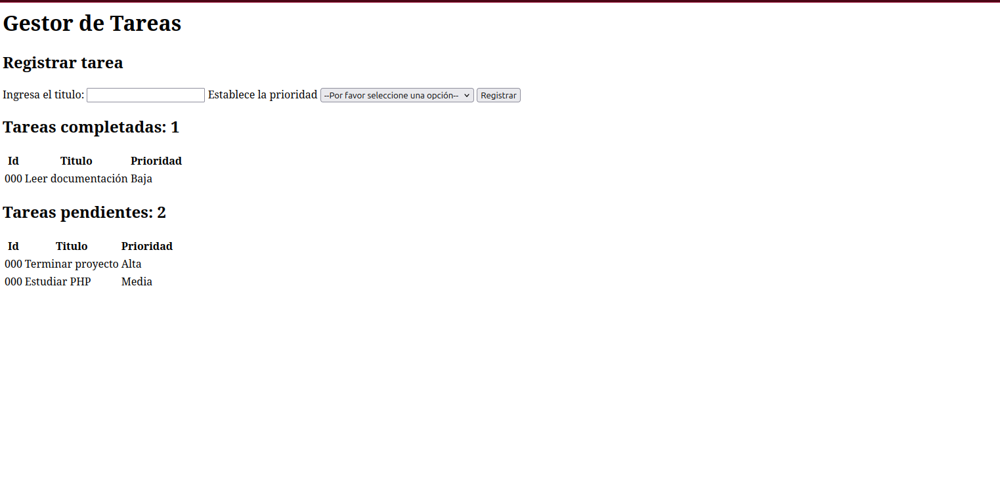
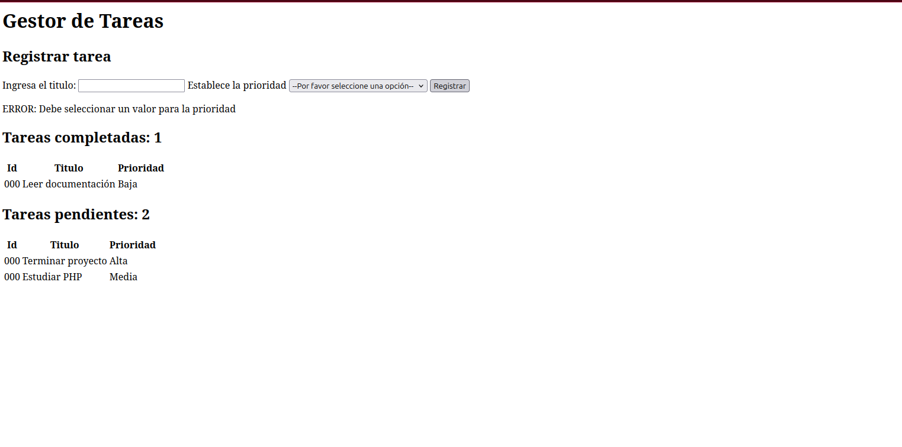
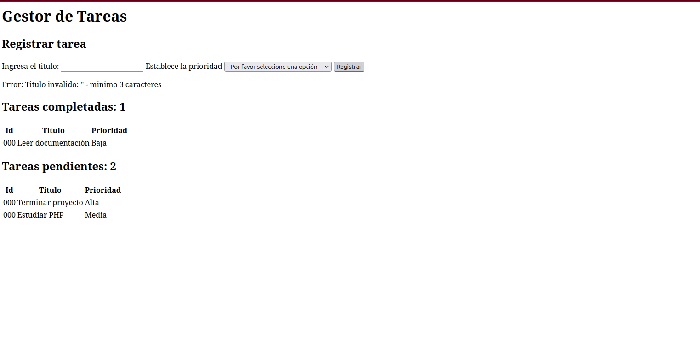

# Gestor de tareas PHP
## Descripción del proyecto
Este proyecto es un gestor de tareas construido con PHP 8 y HTML5, utilizando Programación orientada a Objetos para la creación de tareas, uso de Excepciones que permiten manejar los errores adecuadamente y una preparación de arquitectura para persistencia con PDO para establecer la conexión con MySQL, por el momento usa datos en memoria.
Permite organizar las tareas de acuerdo al nivel de prioridad y separar las tareas completas de las que aún están pendientes.
Además, utiliza sanitización de datos para prevenir XSS.

## Capturas de pantalla
### Estado inicial


### Error de prioridad


### Error de nombre


### Tarea creada exitosamente


## Conceptos aplicados
  * Programación Orientada a Objetos
  * Exceptions
  * Manejo de formularios HTTP y Sesiones

## Instrucciones de instalación
  1. Tener PHP instalado (Versión 8+). Instrucciones según tu sistema operativo: 
  * Ubuntu/Debian: sudo apt install php 
  * Mac: brew install php 
  * Windows: https://www.php.net/downloads
  2. Clonar el repositorio: git clone https://github.com/YafteMContreras/Gestor-de-Tareas-PHP
  3. Entrar al directorio del proyecto: cd Gestor-de-Tareas-PHP
  4. Levantar el servidor embebido: php -S localhost:8000
  5. Abrir en el navegador: http://localhost:8000

## Estructura de Archivos
```
Gestor-de-Tareas-PHP/
├── config/
│   └── config.php          # Configuración global y constantes
├── includes/
│   ├── ContadorTareas.php  # Clase para IDs autoincrementales
│   ├── Database.php        # Conexión PDO con patrón Singleton
│   ├── footer.php          # Cierre HTML
│   ├── formulario.php      # Formulario de registro de tareas
│   ├── funciones.php       # Funciones de presentación
│   ├── header.php          # Cabecera HTML
│   ├── Tarea.php           # Clase Tarea
│   └── TareaInvalidaException.php  # Excepción personalizada
└── index.php               # Lógica principal
```

## Roadmap
 * **v2.0** — Podrá crear cuentas locales de usuario, guardar tareas de forma persistente en una base de datos, exportar tareas en formato CSV o PDF y crear, borrar y actualizar tareas.
 * **v3.0** — Implementará sistema de roles, notificaciones por email al crear o completar tareas, API REST documentada y consumible desde aplicaciones externas y Dashboard con estadísticas
